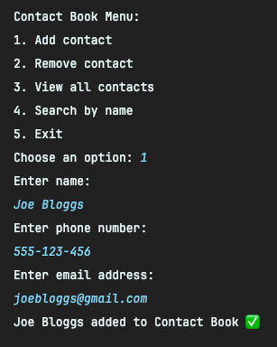

# Java-ContactBook

Refreshing prior Java knowledge with a simple OOP console app that creates, and manages contacts within contact book.

**-- Add Contact --**

**-- View Contacts --**

**-- Search Contact --**

**-- Remove Contact --**

